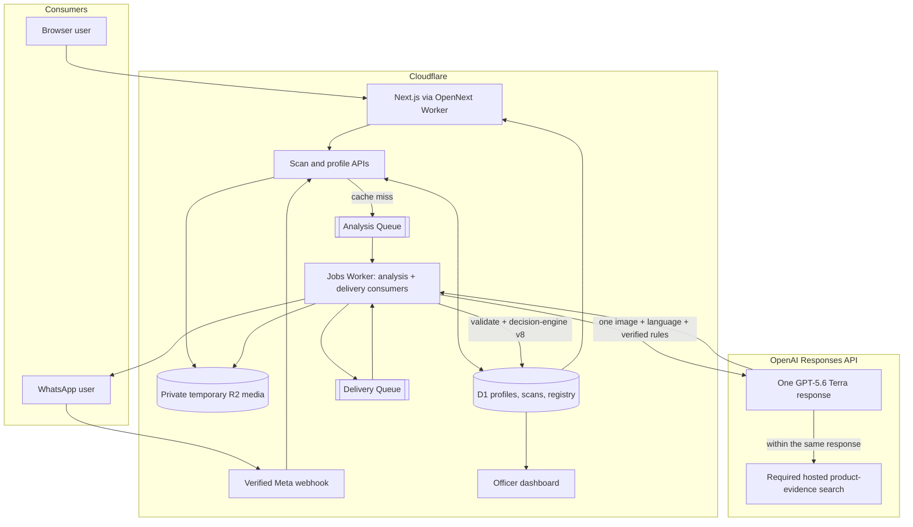

# Front of Pack — High Level Design

> **Status:** v6.0 — competition release-candidate shopper-brief architecture
> **Runtime pins:** `terra-analysis.v16` · `analysis-result.v3` · `decision-engine.v8`
> **Audience:** the implementing agent (Codex) and the solo maintainer
> **Companion docs:** [`LLD.md`](./LLD.md) — implementation contract; [`FINAL_PLAN.md`](./FINAL_PLAN.md) — authoritative scope and deadline; [`EXECUTION_PIPELINE.md`](./EXECUTION_PIPELINE.md) — live tasks and proof; [`CLOUDFLARE_SETUP.md`](./CLOUDFLARE_SETUP.md) — repository, billing, account, resource, deployment, and domain onboarding
> **Supersedes:** the retired *Front of Pack Playbook*. The Playbook is background material, not an implementation source of truth.
> **Precedence:** if scope or priority conflicts, `FINAL_PLAN.md` wins; this HLD and the LLD must then be reconciled to it.

---

## 1. What this is

India requires important information to be printed on packaged consumer products, but that information is often hard to read, hard to understand, and disconnected from the claims on the front. Relevant public-service paths—rules, certification, recalls, licence information, and grievance reporting—are also fragmented across specialist systems.

**Front of Pack is an independent, multilingual citizen-access layer for packaged-product labels and the appropriate Indian consumer service.** Food remains the competition's hero journey, but the product also understands cosmetics, personal care, household, baby-care, pet-care, and other packaged consumer labels already supported by LabelSensei. It is not a generic wellness scanner and does not pretend to be a government system.

**Front of Pack** gives the consumer one simple interaction:

1. Use the channel's remembered language; WhatsApp uses English when none has been set.
2. Upload or photograph **one image**.
3. Receive a result for up to six sufficiently identifiable products in the image.

The image may show:

- one packaged product,
- several packaged products,
- a shelf or grocery haul, or
- a shopping-app cart or order screenshot containing product names.

The result can include:

- every evidence-backed warning, absolute nutrition plus printed or clearly calculated %RDA, and a deterministic experimental 0–10 shopper rating when reproducible deductions exist,
- ingredients and additives in plain language,
- a factual profile, direct verdict, supporting analysis, and visible marketing claims checked against the available composition,
- a separate exact synthetic identifier demonstration,
- an optional grievance draft for the user's review and manual use,
- a whole-image summary when several products are present, and
- localized model-authored shopper content on web and WhatsApp.

The judged hero is packaged food and non-alcoholic beverages because it gives the sharpest FSSAI/FoSCoS public-service story. The same one-call path also supports cosmetics, personal care, household, baby-care, pet-care, and supplements where an enabled rule/service pack exists. When only general label comprehension is covered, the result must say so instead of implying category-specific regulatory review. The primary experience is the public web app; the same core analysis is a must-have WhatsApp flow.

### 1.1 Architecture principle

> **One image in. One GPT-5.6 Terra Responses API request. One complete result out.**

GPT-5.6 Terra performs the complete semantic analysis in one pinned request:

- reads the image,
- identifies up to six sufficiently visible products,
- extracts visible label facts,
- uses required hosted web search for exact-product corroboration and comprehensive nutrition, ingredient, allergen and claim research,
- applies the supplied verified regulatory context,
- produces product identity, profile tags, the verdict/summary, claims, evidence, and finding prose, and
- writes all consumer-facing explanation text directly in the selected language.

There is no separate triage call, crop/segment loop, cart parser, per-product fan-out, product-resolution model, synthesis model, or explanation model.

Application code does not paraphrase Terra's prose. After strict validation, decision-engine v8 derives reproducible whole-pack arithmetic, printed-first or FSSAI-reference %RDA, literal claim consistency, diet/veg-source and allergen signals from provenance-linked structured values. It also computes the experimental 0–10 rating from fixed, published deductions; the score is null when no reproducible deduction applies. A null score distinguishes completed checks with zero deductions from an unreadable/unchecked product instead of calling both “insufficient evidence.” The presentation layer merges duplicate nutrient topics and orders structured indicators consistently across languages. Terra does not author the rating or final severity colour/order: red is reserved for engine-origin warnings, while model context may be amber or green. Calculated values are labelled by scope and source; missing inputs produce no derived conclusion.

The engine may report that an exact printed “free-from” claim conflicts with an exact transcribed ingredient token. It does not infer chemical classes, formulation, intent, legality, or automatically characterize a cosmetic claim as greenwashing. Every formula, test, reference and limitation is public at `/how-we-decide`.

This deliberately favours a small, fast architecture for the hackathon. Model quality is controlled with a strict output schema, a versioned prompt, verified regulatory context, evidence requirements, curated samples, and regression tests.

### 1.2 Predecessor boundary

Front of Pack is a new application and repository, not a small update to the existing LabelSensei site.

The verified predecessor consists of:

- a static English LabelSensei marketing page;
- a WhatsApp/Gemini n8n prototype returning an unstructured 1–10 health/quality rating; and
- prior label-photo, WhatsApp, and general multi-category product learnings.

Those facts are disclosed as pre-existing work. The functional Cloudflare web scanner, direct Meta WhatsApp channel, Terra contract, multilingual profiles, evidence validation, verified category/service routing, grievance assistance, registry/officer proof, and trust controls are implemented hackathon work with proof recorded in the execution pipeline.

The legacy n8n export contains unsafe credential and webhook handling. It is never committed, modified in place, reused, or shipped. Front of Pack replaces n8n entirely with a verified Meta webhook on Cloudflare Workers plus Cloudflare Queues. See `EXECUTION_PIPELINE.md` §2–§6.

---

## 2. Consumer-first flow

The consumer should not need to understand image types, pipeline stages, or data provenance before scanning.

Internally, Terra handles the differences between a label photo, a multi-product photo, and a cart screenshot inside the same prompt and the same `items[]` response.

### 2.1 When the image contains package details

The image is the primary source. Text is transcribed as printed. The model must not replace visible package information with conflicting web information.

### 2.2 When only product names are visible

This is common in shopping-app screenshots and front-only photos. When composition is needed but only a product name or thumbnail is visible, Terra must use the Responses API hosted web-search tool within the same request. Every web-derived fact must carry a source URL and must be visibly labelled as not read from the user's package.

If no credible composition source is found, that product keeps only supportable facts and requests a clearer back-of-pack photo when needed. The rest of the products still return normally.

### 2.3 When many products are visible

Terra returns one entry per product in a single bounded `items[]` array. It analyzes the original full image; the application does not crop regions or make another model request per item.

The hackathon version returns at most **six** products from one image. This is enough to prove multi-product and cart behaviour while keeping latency, evidence quality, and mobile readability controllable. If more are visible, the result says it was truncated and asks the consumer to upload a closer image. The limit can be raised after measured evaluation.

---

## 3. Regulatory spine

The model receives a compact, versioned context containing only enabled and verified rules. These rules map to published Indian instruments.

| Domain | Regulator | Instrument | What the analysis checks |
|---|---|---|---|
| Food and beverage | FSSAI | Food Safety and Standards (Labelling & Display) Regulations, 2020 | Mandatory declarations, nutrition, additives, allergens, veg/non-veg mark |
| Food nutrition presentation | FSSAI | 2022 draft Front-of-Pack Labelling / Indian Nutrition Rating proposal | Experimental nutrition score or warnings, never presented as an official current FSSAI label |
| Food safety events | FSSAI | Food Recall Procedure regulations | Exact synthetic product/lot recall matches |
| Food licensing | FSSAI | 14-digit FBO licence / registration format | Structure and exact synthetic registry status |
| Food claims | FSSAI | Advertising and Claims Regulations, 2018, plus current advisories | Visible nutrition and composition claims against available evidence |
| Cosmetics and personal care | CDSCO | Cosmetics Rules, 2020 | Required label particulars and category-specific restrictions present in the verified pack |
| BIS-certified goods | BIS | Applicable certification/marking requirements | Standard-mark or licence evidence and route to BIS Care where applicable |
| Pack declarations | Legal Metrology | Packaged Commodities Rules, 2011 | MRP, quantity, manufacturer, consumer-care and date declarations across packaged goods |
| General consumer grievance | Department of Consumer Affairs | National Consumer Helpline | Consumer grievance route when no specialist service is appropriate |

### 3.1 Verification gate

Every enabled rule, numeric threshold, and clause citation must have a verified source. The build fails if an enabled rule is unverified.

The model may reference only rule IDs included in the request's verified rule context. The validator rejects unknown, disabled, or unverified rule IDs. This validates the contract; it does not recalculate the model's verdict.

The public `/how-we-decide` page groups the enabled rules, formulas, fixed rating deductions, ingredient dictionary and source links used by the system. A versioned service directory exposes only verified routes such as FSSAI/FoSCoS, BIS Care, and the National Consumer Helpline. Every experimental food rating carries a standing disclaimer:

> Experimental research presentation based on draft FSSAI front-of-pack policy context. It is not an official FSSAI score, warning, approval, or legal determination.

---

## 4. System context

GPT-5.6 Terra supports image input, Structured Outputs, and hosted web search through the Responses API. The implementation must still confirm the current SDK syntax before coding against it. See the [official model documentation](https://developers.openai.com/api/docs/models/gpt-5.6-terra).

### 4.1 Exact meaning of “one call”

- An original-byte cache hit makes **zero** OpenAI requests.
- A cache miss makes **one** `responses.create` request.
- Terra may invoke hosted web search during that response; this is part of the same Responses API execution.
- The application does not make a second LLM request for any product, explanation, or translation.
- Automatic SDK retries are disabled. A failed or schema-invalid response fails honestly and may be retried only through a new user action.
- Before network I/O, the Queue consumer atomically records `provider_started_at`. A redelivered Queue message with that field set must never call OpenAI again; it resolves the ambiguous attempt as failed. Queue retries may repeat pre-provider media/database work or post-provider delivery, not the semantic request.

Post-response D1 reads are allowed because they are exact application lookups, not LLM calls. They attach product history and clearly synthetic licence/recall records without rewriting Terra's analysis. Profile reads are also deterministic: they select presentation language and accessibility preferences, not the product finding.

Both channels use the same queue consumer. Cloudflare Queues carries only small job metadata; images live temporarily in a private R2 bucket because Queue messages are not media storage. A separate delivery queue may retry WhatsApp delivery without repeating the model call.

---

## 5. Analysis request

Each cache miss sends Terra:

- the validated original image bytes and dimensions,
- the resolved channel language (including WhatsApp's English fallback when unset),
- the unified analysis instructions,
- the strict JSON Schema,
- the current prompt and schema versions,
- compact enabled and verified category rules plus an allow-listed citizen-service directory,
- the allowed evidence and copy policies, and
- the hosted `web_search` tool in required mode, with follow-up searches available for exact-product nutrition, ingredients and allergens.

Terra returns one atomic model `AnalysisResult`; after validation, the application attaches the derived engine result. The model result contains:

- image readability and result completeness,
- zero or more product items,
- product identity and category,
- visible and web-derived facts with field-level provenance,
- nutrition and ingredient observations, including printed %RDA and the exact inputs needed for clearly labelled engine calculations,
- only visibly printed claims and their evidence-backed status; no claim section is rendered when the submitted image contains no claim,
- independently useful findings, a factual profile, verdict/summary and supporting analysis, with evidence links,
- localized consumer explanation,
- category coverage and an allowed next-service route ID when appropriate,
- web sources actually used, and
- a whole-image summary.

Per product, schema v3 allows up to twelve findings, twenty evidence observations, eight citations, eight visible-claim audits and six factual profile tags. Each finding has a required semantic `topic` so total sugar, added sugar, sodium nutrition and sodium-named ingredients cannot collide through title text. The schema has no model-authored `rating` field. Decision-engine v8 attaches signals plus the deterministic rating, and the presentation layer maps model and engine material into `ShopperIndicator` records carrying `origin`, `topic`, and `ruleId`. The render order is fixed from those structured fields: red/amber indicators; product identity; experimental rating; profile; verdict; supporting analysis; conditional Claims section; evidence confidence and match basis; expandable package/online evidence; verified next step.

The detailed contract is defined in `LLD.md` §7.

### 5.1 Model responsibilities

Terra must:

1. Treat all products in the image as one analysis job.
2. Preserve visual or cart order in `items[]`.
3. Prefer image evidence over web evidence.
4. Transcribe visible label text exactly and never invent missing values.
5. Search the exact Indian product and pack for nutrition, ingredients/additives, allergens, sugar, sodium, saturated fat, caffeine, palm oil/palmolein, claims and useful positives; prefer manufacturer sources, then credible exact-product retailers, and never stop after the first warning.
6. Keep image and web provenance separate at field level.
7. Use only the supplied verified regulatory rules and service route IDs.
8. Return `unknown` when evidence is insufficient or contradictory.
9. Produce identity, profile, summary/verdict, claim/evidence structures, and finding prose in the requested language where consumer-facing.
10. Keep raw brand, product, claim, and ingredient text as printed.
11. Use restrained regulatory wording, not medical or wellness advice.

### 5.2 Application responsibilities

Application code must:

1. Validate MIME, decoded dimensions and pixel count; preserve the original encoded bytes and pixel dimensions; hash and cache those bytes.
2. Load the verified rule context and construct one request.
3. Validate the response and every profile/claim/nutrition/finding evidence reference without repairing model prose.
4. Apply decision-engine v8 to add deterministic whole-pack, printed-first/calculated-RDA, literal-claim, diet and allergen signals plus fixed rating deductions with provenance.
5. Keep exact synthetic identifier lookup as a separate clearly labelled demonstration surface; never imply a live registry query.
6. Persist the model result, derived signals, evidence, versions, usage, and validation report.
7. Build structured `ShopperIndicator` records, reserve red for engine-origin warnings, use amber for model context or moderate engine signals, merge duplicate nutrient topics, and apply the same topic order in every language before rendering rating, profile, verdict, analysis and visible claims.
8. Resolve an allowed service route ID to its verified public link and add fixed UI notices and statutory disclaimers.

### 5.3 Removed architecture

The following concepts from v1 are intentionally removed:

- separate triage and extraction calls,
- bounding-box cropping and region re-entry,
- a dedicated cart/list parser,
- per-product model calls and bounded worker pools,
- a separate Luna reasoning model,
- a deterministic verdict engine,
- a post-verdict explanation call,
- stage-by-stage SSE events, and
- stage-specific retry and caching logic.

`items[]` remains a response data structure because the consumer may upload multiple products. It is not a separate parse stage.

---

## 6. Evidence, provenance, and trust

Every material fact must identify its source.

| Provenance | Meaning | UI treatment |
|---|---|---|
| `package` | Read from the uploaded package image | “Read from the package” in expandable evidence |
| `hosted_web_search` | Obtained through Responses hosted search | “Found online”, product-match basis, citation and provisional wording where needed |
| `verified_rule` | Supplied from an enabled official rule/reference pack | Public rule/formula source on `/how-we-decide` |
| unavailable | No credible fact exists | No fabricated value; limitation or retake guidance only |

Rules:

1. Visible package data wins over web data.
2. Every web-derived material fact must reference a source returned by the hosted search execution; a URL invented in JSON is not accepted as proof.
3. Search sources and response annotations are stored with the scan.
4. Contradictory sources are returned as structured competing values with their source references; the UI displays the conflict and the affected conclusion must be `unknown`.
5. No model finding may use an invented value. Model-origin findings never become red warnings; deterministic RDA/whole-pack arithmetic may use exact structured values and must show formula, scope and reference.
6. Low-confidence or incomplete fields must be listed under `uncertainties` rather than silently filled.
7. Mixed conclusions use separate package and hosted-search evidence references; `mixed` is not an evidence-origin enum.
8. Model-authored identity carries confidence and match basis; profile, claim and finding structures carry evidence references, and the model supplies the evidence objects themselves. Engine warnings and experimental rating deductions carry deterministic rule/input references; free-form prose alone is not evidence.

Strict structured output guarantees a predictable shape, not factual truth. The trust strategy is evidence visibility, source storage, verified prompt context, honest unknowns, and regression testing—not pretending the model cannot be wrong.

---

## 7. Multi-product behaviour

There is one path for all images and supported categories. A mixed image may contain food and non-food products; Terra classifies each item and applies only its enabled rule pack. Multi-product analysis is a required product capability and a differentiator, but the judged hero demo uses one clear packaged-food image so the citizen value is immediately legible.

### 7.1 Physical packages

Terra identifies every sufficiently visible product in the original image and returns them in `items[]`. It may analyze different visible surfaces without asking the server to crop them.

### 7.2 Cart and order screenshots

The screenshot contains names and prices, not package composition. Terra reads those names and uses web search where necessary within the same response. Results based on web composition are visibly provisional.

Exact variant or pack-size ambiguity must remain uncertain. The model must not silently choose a nearby product. The consumer can use “Wrong product?” to upload a closer front, barcode, or back image.

### 7.3 Whole-image summary

The same Terra response includes analyzed count, unknown count, flagged count, the strongest material finding, and whether the image was truncated. Synthetic recall matches are attached afterward as separate banners.

The interface returns the whole result together. It does not label the basket itself healthy/safe and does not promise per-item progressive streaming.

---

## 8. Product surfaces

### 8.1 Web — primary judged surface

Next.js App Router, server-rendered and mobile-first. No login is required.

| Route | Purpose |
|---|---|
| `/` | Remember language, upload one image, select a cached demo, and render the complete shopper brief |
| `/how-we-decide` | Warning order, fixed rating deductions, RDA formulas, claim tests, ingredient dictionary, limitations and official sources |
| `/grievance` | Review and copy an editable local draft; never submits |
| `/registry` | Exact identifier lookup against clearly synthetic demonstration data |
| `/officer` | Minimal dashboard of aggregate human-review leads |

There is no separate basket route or basket analysis engine. A scan naturally contains one or many items.

The homepage includes instant cached demonstrations through the exact production renderer: AloFrut for printed and whole-bottle RDA plus additives/claims; English Oven for whole-pack sodium, allergens and claims; Haldiram for front-only online evidence; and a user-provided five-item cart screenshot with no visible PII whose validated current-schema cached reconstruction identifies five products. Cached demos disclose that no model call runs on click or during recording. The cart image is disclosed as a third-party asset, and its ownership/permitted-use and attribution gate remains open until confirmed before the final recording.

### 8.2 WhatsApp — must-have access channel

WhatsApp uses the same Cloudflare-hosted API, D1 state, R2 media path, Queue consumer, and one-call invariant as web. There is no n8n deployment.

1. The user sends one image; the saved language is used, or English when no language has been set.
2. The first image is analyzed immediately rather than being held behind a language menu.
3. The Worker verifies Meta's verification token and raw-body POST signature, writes the idempotent event and encrypted short-lived delivery context, enqueues the job, and acknowledges immediately.
4. The Queue consumer retrieves the media through the fixed Graph media-ID flow into private R2, invokes the shared analysis path once, and enqueues delivery.
5. WhatsApp returns localized, section-bounded shopper-brief chunks from the stored result: every product's structured red/amber indicators globally first, then rating, profile, verdict, analysis, visible claims and any service-route reason.
6. A language command updates the profile for future image jobs; it does not change an already queued job. Delivery never invokes another model call.

The web result is the complete expandable surface for large multi-product analyses. WhatsApp chunks only at section boundaries (3,500 Unicode code points each). Delivery retries only before the first chunk is sent; a later-chunk failure terminates rather than duplicating earlier messages.

Language-name/code commands are available without using the website. Until one is received, WhatsApp explicitly defaults to English and analyzes the first image. If the user changes language, future image jobs snapshot and use that language. Re-rendering an existing result in a new language requires a new one-call analysis unless that image-language combination is already cached.

The delivery consumer may retry Graph message delivery. It reads only the already stored result and can never repeat Terra analysis.

### 8.3 Registry and officer dashboard — secondary proof

The registry and dashboard are secondary demonstrations; reviewers do not need either to complete the citizen journey. The registry performs exact lookup against clearly synthetic FSSAI/BIS identifiers. The basic-auth-protected officer page exposes only redacted counts grouped by analysis status and language—never images, identifiers, profiles or model output. Location is neither collected nor inferred.

---

## 9. Profiles, languages, and accessibility

Supported language codes:

`en`, `hi`, `mr`, `bn`, `ta`, `te`, `kn`, `gu`, `ml`, `pa`, `or`, `ur`

The web user chooses a response language and the app remembers it for that anonymous browser profile. WhatsApp uses English when its profile has no language, analyzes the first image with that fallback, and remembers any later language command for future jobs. The hackathon does not silently link the two channel identities.

The deployed profile stores only preferred language plus opaque channel identity metadata. It does not store allergies, medical conditions, pregnancy, diet, or other sensitive health data. Language never changes the objective product finding.

Terra generates the consumer explanation directly in the saved language in the one response. Raw label text remains verbatim.

Model-authored findings and WhatsApp structural headings are localized. Fixed website chrome remains English in the current hackathon build; full website-catalogue and RTL localization is post-hackathon work. The web UI remains keyboard- and screen-reader-accessible.

---

## 10. Data architecture

Cloudflare D1 is the small SQLite-compatible system of record. Verified regulatory/service context and the synthetic identifier demonstration remain versioned code data where that is faster and easier to audit.

| Store | Holds |
|---|---|
| Anonymous Profiles | Preferred language and timestamps; no medical profile |
| Channel Identities | Keyed browser-token or WhatsApp-number digest mapped to a profile; no silent cross-channel linking |
| Scans | Status, versioned cache key, validated result JSON, sources, local matches, timing, usage, and error |
| Product Registry | Minimal table reserved for future evidence-backed observations; the public demo uses separate exact synthetic identifiers |
| Regulatory Context | Versioned category rule packs and source links supplied to Terra |
| Service Directory | Allow-listed FSSAI/FoSCoS, BIS Care, NCH, and other verified citizen routes |
| WhatsApp Jobs | Provider message ID, payload digest, encrypted short-lived recipient, delivery state and expiry |
| Synthetic Government Data | Clearly marked FSSAI-licence and BIS CM/L example records |
| Private R2 Media | Random-key, decode-validated original upload; never public; explicitly deleted at terminal processing, with one-day lifecycle eligibility only as a non-exact orphan backstop |

This is intentionally a hackathon schema, not a speculative workflow platform. D1 stores JSON as text and IDs/timestamps are generated in application code. Attempt leases, immutable artifact histories, cache-pointer tables, and generalized orchestration are production-hardening work after the submission.

### 10.1 Product identity and future versioning

Terra returns brand/name/variant/GTIN with product-level confidence, evidence and an explicit online match basis. The deployed scanner does not promote those observations into a canonical registry or rewrite its verdict. Canonical product/version workflows require human review and are post-hackathon hardening.

### 10.2 Exact synthetic identifier demonstration

`/registry` accepts an entered FSSAI licence or BIS CM/L identifier and performs exact matching against two clearly synthetic local records. It is separate from scan analysis, never fuzzy-matches, and never implies that a live government system was queried.

---

## 11. Performance, caching, and cost

| Concern | Initial target |
|---|---|
| Cached sample | Under 500 ms |
| OpenAI calls per cache miss | Exactly one attempted Responses API request |
| OpenAI calls per cache hit | Zero |
| Multi-product capacity | Up to 6 returned items |
| Persisted analysis payload | Maximum 512 KB across serialized JSON columns |
| Queue message | IDs + attempt number only; under 128 KB |
| Queue batch | One analysis/delivery job per consumer invocation |
| Device floor | Low-cost Android device on mobile data |

Live latency targets will be set after measurement because one response that uses web search may take longer than an image-only response.

The cache key includes the original validated image hash, selected language, model ID, prompt version, schema version, rule/service versions, engine version and normalization version. Only complete validated results are cache hits. A D1 unique key lets concurrent submissions reuse one analysis row and enqueue at most one provider attempt.

D1, R2 and Queue writes are not one transaction. Intake records a re-enqueueable pre-provider state; duplicate Queue messages remain safe because only a conditional D1 claim for the exact attempt authorizes OpenAI.

Image-only cached results remain valid until a version component changes. Web-backed results use a short expiry. Refreshing a stale result creates a new explicit user-initiated scan; the application never silently makes a second model call. The analysis consumer catches all post-provider errors and acknowledges the Queue message after recording failure so automatic Queue redelivery cannot duplicate billing.

Usage, hosted-search use, latency and validation status are stored per scan; public methodology and limitations live on `/how-we-decide`.

Workers Paid/Standard activation is a platform gate: the Jobs Worker needs configurable CPU time, while memory remains 128 MB. Original-image validation, OpenAI fetch, OpenNext bundle and all APIs must pass `workerd` preview and deployed Worker tests. Native `sharp` is not assumed. D1's 2 MB row limit, Queue's 128 KB message limit and Worker bundle/startup limits are treated as build failures, not production surprises.

---

## 12. Security, privacy, and compliance

- No named user account or web PII is required. An opaque random, HttpOnly, SameSite cookie identifies an anonymous profile.
- Users uploading cart screenshots are prompted to crop names, addresses, phone numbers and order IDs.
- Uploaded images preserve original encoded bytes for label readability and may retain EXIF/GPS metadata. The UI discloses temporary processing, advises users not to include personal surroundings, and terminal deletion plus the R2 lifecycle backstop limits retention.
- Browser and WhatsApp identity digests use keyed HMAC-SHA256 with a server secret. A raw phone number or browser token is never used as a database key or written to logs.
- WhatsApp and Meta necessarily receive routing and media data. The Worker encrypts the recipient before short-lived D1 storage; the delivery consumer deletes it after terminal send or expiry, and logs never contain it.
- The user can change preferences and reset/delete the anonymous channel profile. Scan history is not durably linked into a consumption dossier.
- Web and WhatsApp images use random-key private R2 objects only while an asynchronous job is pending; terminal logic explicitly deletes them. A one-day lifecycle rule is a delayed orphan backstop and may execute after eligibility. Validated results retain evidence references, not public copies of the upload.
- Secrets use Cloudflare Workers Secrets/Secrets Store bindings, never plaintext Wrangler variables.
- WhatsApp webhook signatures are verified.
- The secret-bearing legacy n8n export is never copied into the repository; all Meta credentials are rotated before the direct Worker webhook is connected. n8n is not deployed for Front of Pack.
- No official government branding is used.
- Licence and recall datasets are synthetic and labelled on every relevant surface.
- There is no live FoSCoS/CDSCO registry or API integration.
- Hosted web search is for public product-composition evidence, not for pretending to query a government registry.
- Regulatory sources are verified offline and shipped in the versioned context rather than rediscovered during a scan.
- Every verdict says it is product-label analysis, not medical or dietary advice.
- Public registry pages never expose user-uploaded images or screenshot PII.

Standing footer:

> An independent hackathon prototype. Not affiliated with or endorsed by FSSAI or any government body.

---

## 13. Failure modes

| Failure | Consumer behaviour |
|---|---|
| Image unreadable | Explain why and ask for a clearer image; no result is invented |
| Some products unreadable | Return readable products and mark the others unknown |
| Only names visible and search succeeds | Return provisional, web-sourced results with links |
| No credible composition source | Identify the product if possible; withhold composition verdict |
| Search sources conflict | Show the conflict; affected conclusion is unknown |
| More than 6 products | Return up to the supported limit, mark truncated, ask for a closer image |
| Category without a verified rule pack | Explain visible facts only, mark regulatory coverage unavailable, and offer only a verified general consumer route |
| Schema or contract validation fails | Reject the response; show a retry action; do not repair with another model call |
| Model timeout/rate limit | Show a retry action; no partial model verdict |
| R2/D1/Queue intake failure | Fail before provider start; keep no orphan media beyond cleanup policy |
| Analysis Queue redelivery after provider start | Record ambiguous failure and do not call OpenAI again |
| WhatsApp delivery failure | Keep the validated result, retry delivery independently, and never repeat analysis |
| Worker image normalization exceeds runtime limits | Reject the upload with a closer/smaller-image request; do not persist or forward it |
| No verified rule coverage | Say “not yet covered”; never default to a pass |

---

## 14. Deployment

| Piece | Choice |
|---|---|
| App/API | Next.js App Router on Cloudflare Workers through `@opennextjs/cloudflare` |
| Model | GPT-5.6 Terra through the OpenAI Responses API |
| Required retrieval | Hosted `web_search` tool in the same response; package facts still take precedence |
| Database | Cloudflare D1 with a compact SQLite-compatible schema |
| Temporary media | Dedicated private Cloudflare R2 with terminal deletion and non-exact one-day lifecycle eligibility backstop |
| Async analysis | Cloudflare Analysis Queue + consumer Worker; 128 KB job metadata only, never image bytes |
| WhatsApp delivery | Separate Cloudflare Delivery Queue + consumer Worker; stored result only |
| Secrets | Cloudflare Workers Secrets/Secrets Store bindings |
| Domain | Cloudflare custom domain; `workers.dev` remains a non-blocking deployment fallback |
| Observability | Workers Logs plus D1 timing, usage, validation and delivery status |

Queues provide reliable work beyond the HTTP response lifecycle for both web and WhatsApp. They do not create more semantic stages: one analysis job still owns at most one Terra request. Queue messages contain IDs and attempt numbers only; encrypted WhatsApp routing remains in D1 and R2 holds the temporary image.

---

## 15. Explicitly out of scope

- Live government-system integration
- Real grievance submission; the app drafts only
- Commercial barcode-composition feeds
- Medicines, medical devices, clinical advice, and other high-stakes categories without an explicitly verified rule pack
- Government authentication, named accounts, cross-device profile sync, or web notifications
- Individualized medical, dietary, or clinical recommendations
- Confirming a legal violation or taking enforcement action
- A second LLM call to fix, translate, resolve, or explain the first response
- Production-scale leases, generalized queues, immutable artifact lineage, or automatic provider retries
- n8n, Vercel, or a separately hosted application/database backend in the submitted architecture

---

## 16. What “done” looks like

A reviewer can:

1. Return to the public mobile web experience and have Marathi remembered without creating an account.
2. Upload one packaged-product image and receive a useful localized result from exactly one Terra request.
3. See engine-owned red warnings, model context, absolute values plus printed/calculated %RDA, deterministic experimental rating, profile, verdict, supporting analysis and conditional visible-claims audit.
4. Distinguish facts read from the package from provisional facts found online, including name-only/cart results.
5. Create a clearly unsubmitted, editable grievance draft when an allow-listed route is appropriate.
6. Upload an image containing several food and/or non-food products and receive up to six ordered results without crops or per-product model calls.
7. Send a first image over WhatsApp and receive an English analysis by default, or use a language command to change future analyses.
8. Inspect clearly synthetic licence/recall matches and the minimal registry/officer proof without mistaking them for live government systems.
9. See FSSAI/FoSCoS, BIS Care, or NCH guidance only when the category and issue match an allow-listed route.
10. Open `/how-we-decide` to inspect formulas, fixed rating deductions, evidence rules, limitations and official sources.

The two-minute architecture explanation is:

> The resolved channel language is applied when the consumer uploads one image; WhatsApp explicitly falls back to English when unset. A Cloudflare Worker stores idempotent state in D1, places validated original media temporarily in private R2, and publishes one Analysis Queue job. The Jobs Worker makes one GPT-5.6 Terra Responses API request for up to six products with required hosted product-evidence search. It validates model-owned identity/profile/summary/findings/claims/evidence, then adds deterministic RDA/whole-pack/claim/diet/allergen signals and a fixed-deduction rating. Structured indicators reserve red for engine warnings, merge nutrients, and order topics across languages before the result is stored and rendered on web or through the WhatsApp Delivery Queue.
