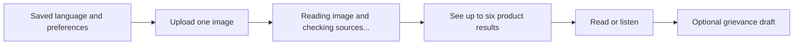
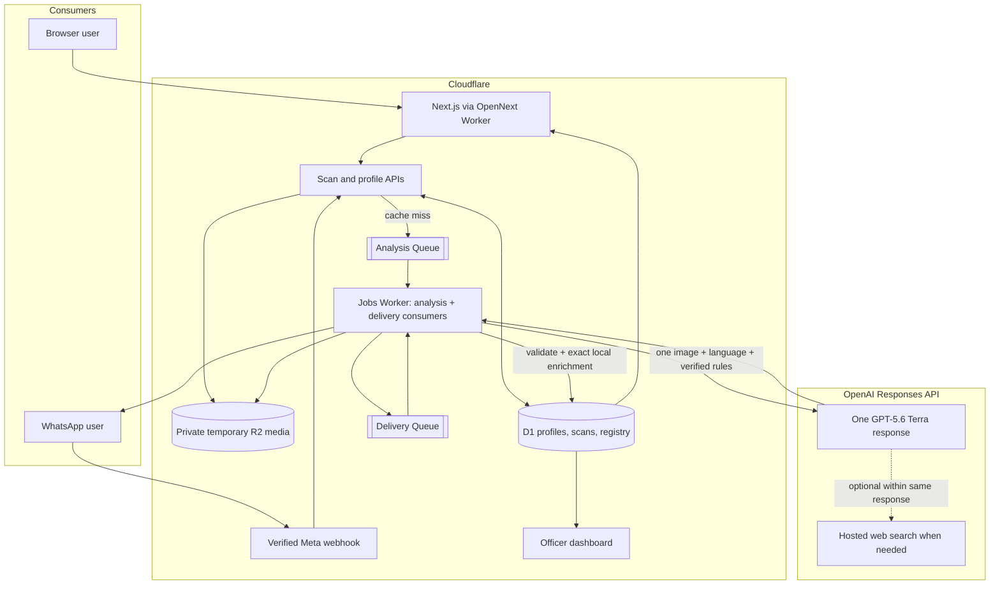

# Front of Pack — High Level Design

> **Status:** v4.0 — Cloudflare-native final hackathon architecture
> **Audience:** the implementing agent (Codex) and the solo maintainer
> **Companion docs:** [`LLD.md`](./LLD.md) — implementation contract; [`FINAL_PLAN.md`](./FINAL_PLAN.md) — authoritative scope and deadline; [`EXECUTION_PIPELINE.md`](./EXECUTION_PIPELINE.md) — live tasks and proof; [`CLOUDFLARE_SETUP.md`](./CLOUDFLARE_SETUP.md) — repository, billing, account, resource, deployment, and domain onboarding
> **Supersedes:** the retired *Front of Pack Playbook*. The Playbook is background material, not an implementation source of truth.
> **Precedence:** if scope or priority conflicts, `FINAL_PLAN.md` wins; this HLD and the LLD must then be reconciled to it.

---

## 1. What this is

India requires important information to be printed on packaged consumer products, but that information is often hard to read, hard to understand, and disconnected from the claims on the front. Relevant public-service paths—rules, certification, recalls, licence information, and grievance reporting—are also fragmented across specialist systems.

**Front of Pack is an independent, multilingual citizen-access layer for packaged-product labels and the appropriate Indian consumer service.** Food remains the competition's hero journey, but the product also understands cosmetics, personal care, household, baby-care, pet-care, and other packaged consumer labels already supported by LabelSensei. It is not a generic wellness scanner and does not pretend to be a government system.

**Front of Pack** gives the consumer one simple interaction:

1. Select a language once; the channel remembers it.
2. Upload or photograph **one image**.
3. Receive a result for up to six sufficiently identifiable products in the image.

The image may show:

- one packaged product,
- several packaged products,
- a shelf or grocery haul, or
- a shopping-app cart or order screenshot containing product names.

The result can include:

- an **experimental** front-of-pack panel, including an Indian Nutrition Rating-style score or `HIGH IN ...` research warnings only where the available evidence supports them,
- ingredients and additives in plain language,
- marketing claims checked against the available composition,
- licence and synthetic recall matches,
- an optional grievance draft for the user's review and manual use,
- a whole-image summary when several products are present, and
- localized text and read-aloud output.

The judged hero is packaged food and non-alcoholic beverages because it gives the sharpest FSSAI/FoSCoS public-service story. The same one-call path also supports cosmetics, personal care, household, baby-care, pet-care, and supplements where an enabled rule/service pack exists. When only general label comprehension is covered, the result must say so instead of implying category-specific regulatory review. The primary experience is the public web app; the same core analysis is a must-have WhatsApp flow.

### 1.1 Architecture principle

> **One image in. One GPT-5.6 Terra Responses API request. One complete result out.**

For the first version, GPT-5.6 Terra performs the complete semantic analysis in a single request:

- reads the image,
- identifies up to six sufficiently visible products,
- extracts visible label facts,
- uses hosted web search when the image contains only a name or insufficient composition data,
- applies the supplied verified regulatory context,
- produces the verdict, evidence, and explanation, and
- writes all consumer-facing explanation text directly in the selected language.

There is no separate triage call, crop/segment loop, cart parser, per-product fan-out, product-resolution model, synthesis model, or explanation model.

Application code does not paraphrase Terra's prose. After strict validation, a small versioned decision engine may derive reproducible arithmetic signals solely from structured values and percentages printed on the package. These derived signals remain distinct from model findings and record their calculation basis; missing inputs produce no derived conclusion.

Decision-engine v1 also runs a small allow-listed set of literal package-consistency checks. It may report that an exact printed “free-from” claim conflicts with an exact transcribed ingredient token. It does not infer chemical classes, formulation, intent, legality, or automatically characterize a cosmetic claim as greenwashing. Every test and source is public at `/how-we-decide`.

This deliberately favours a small, fast architecture for the hackathon. Model quality is controlled with a strict output schema, a versioned prompt, verified regulatory context, evidence requirements, curated samples, and regression tests.

### 1.2 Predecessor boundary

Front of Pack is a new application and repository, not a small update to the existing LabelSensei site.

The verified predecessor consists of:

- a static English LabelSensei marketing page;
- a WhatsApp/Gemini n8n prototype returning an unstructured 1–10 health/quality rating; and
- prior label-photo, WhatsApp, and general multi-category product learnings.

Those facts are disclosed as pre-existing work. The functional web scanner, Terra contract, persistent multilingual profiles, evidence validation, verified category/service routing, grievance assistance, registry/officer proof, and trust controls are planned hackathon work and may be claimed as new only after their execution-pipeline proof is complete.

The legacy n8n export contains unsafe credential and webhook handling. It is never committed, modified in place, reused, or shipped. Front of Pack replaces n8n entirely with a verified Meta webhook on Cloudflare Workers plus Cloudflare Queues. See `EXECUTION_PIPELINE.md` §2–§6.

---

## 2. Consumer-first flow

The consumer should not need to understand image types, pipeline stages, or data provenance before scanning.

Internally, Terra handles the differences between a label photo, a multi-product photo, and a cart screenshot inside the same prompt and the same `items[]` response.

### 2.1 When the image contains package details

The image is the primary source. Text is transcribed as printed. The model must not replace visible package information with conflicting web information.

### 2.2 When only product names are visible

This is common in shopping-app screenshots and front-only photos. When composition is needed but only a product name or thumbnail is visible, Terra must use the Responses API hosted web-search tool within the same request. Every web-derived fact must carry a source URL and must be visibly labelled as not read from the user's package.

If no credible composition source is found, that product receives an `unknown` result and a request for a clearer back-of-pack photo. The rest of the products still return normally.

### 2.3 When many products are visible

Terra returns one entry per product in a single bounded `items[]` array. It analyzes the original full image; the application does not crop regions or make another model request per item.

The hackathon version returns at most **six** products from one image. This is enough to prove multi-product and cart behaviour while keeping latency, evidence quality, and mobile readability controllable. If more are visible, the result says it was truncated and asks the consumer to upload a closer image. The limit can be raised after measured evaluation.

---

## 3. Regulatory spine

The model receives a compact, versioned context containing only enabled and verified rules. These rules map to published Indian instruments.

| Domain | Regulator | Instrument | What the analysis checks |
|---|---|---|---|
| Food and beverage | FSSAI | Food Safety and Standards (Labelling & Display) Regulations, 2020 | Mandatory declarations, nutrition, additives, allergens, veg/non-veg mark |
| Food nutrition presentation | FSSAI | 2022 draft Front-of-Pack Labelling / Indian Nutrition Rating proposal | Experimental nutrition score or warnings, never presented as an official current FSSAI label |
| Food safety events | FSSAI | Food Recall Procedure regulations | Exact synthetic product/lot recall matches |
| Food licensing | FSSAI | 14-digit FBO licence / registration format | Structure and exact synthetic registry status |
| Food claims | FSSAI | Advertising and Claims Regulations, 2018, plus current advisories | Visible nutrition and composition claims against available evidence |
| Cosmetics and personal care | CDSCO | Cosmetics Rules, 2020 | Required label particulars and category-specific restrictions present in the verified pack |
| BIS-certified goods | BIS | Applicable certification/marking requirements | Standard-mark or licence evidence and route to BIS Care where applicable |
| Pack declarations | Legal Metrology | Packaged Commodities Rules, 2011 | MRP, quantity, manufacturer, consumer-care and date declarations across packaged goods |
| General consumer grievance | Department of Consumer Affairs | National Consumer Helpline | Consumer grievance route when no specialist service is appropriate |

### 3.1 Verification gate

Every enabled rule, numeric threshold, and clause citation must have a verified source. The build fails if an enabled rule is unverified.

The model may reference only rule IDs included in the request's verified rule context. The validator rejects unknown, disabled, or unverified rule IDs. This validates the contract; it does not recalculate the model's verdict.

The public `/thresholds` page groups the same enabled rules by category and shows the source links supplied to the model. A versioned service directory exposes only verified routes such as FSSAI/FoSCoS, BIS Care, and the National Consumer Helpline. Every food-only draft-policy visualization carries this standing label:

> Experimental research presentation based on draft FSSAI front-of-pack policy context. It is not an official FSSAI score, warning, approval, or legal determination.

---

## 4. System context

GPT-5.6 Terra supports image input, Structured Outputs, and hosted web search through the Responses API. The implementation must still confirm the current SDK syntax before coding against it. See the [official model documentation](https://developers.openai.com/api/docs/models/gpt-5.6-terra).

### 4.1 Exact meaning of “one call”

- A normalized-image cache hit makes **zero** OpenAI requests.
- A cache miss makes **one** `responses.create` request.
- Terra may invoke hosted web search during that response; this is part of the same Responses API execution.
- The application does not make a second LLM request for any product, explanation, or translation.
- Automatic SDK retries are disabled. A failed or schema-invalid response fails honestly and may be retried only through a new user action.
- Before network I/O, the Queue consumer atomically records `provider_started_at`. A redelivered Queue message with that field set must never call OpenAI again; it resolves the ambiguous attempt as failed. Queue retries may repeat pre-provider media/database work or post-provider delivery, not the semantic request.

Post-response D1 reads are allowed because they are exact application lookups, not LLM calls. They attach product history and clearly synthetic licence/recall records without rewriting Terra's analysis. Profile reads are also deterministic: they select presentation language and accessibility preferences, not the product finding.

Both channels use the same queue consumer. Cloudflare Queues carries only small job metadata; images live temporarily in a private R2 bucket because Queue messages are not media storage. A separate delivery queue may retry WhatsApp delivery without repeating the model call.

---

## 5. Analysis request

Each cache miss sends Terra:

- the normalized original image,
- the user's selected language,
- the unified analysis instructions,
- the strict JSON Schema,
- the current prompt and schema versions,
- compact enabled and verified category rules plus an allow-listed citizen-service directory,
- the allowed evidence and copy policies, and
- the hosted `web_search` tool in automatic mode.

Terra returns one atomic `AnalysisResult` containing:

- image readability and result completeness,
- zero or more product items,
- product identity and category,
- visible and web-derived facts with field-level provenance,
- nutrition and ingredient observations,
- claims and their evidence-backed status,
- verdict, warnings and rule citations,
- localized consumer explanation,
- category coverage and an allowed next-service route ID when appropriate,
- web sources actually used, and
- a whole-image summary.

The detailed contract is defined in `LLD.md` §5.

### 5.1 Model responsibilities

Terra must:

1. Treat all products in the image as one analysis job.
2. Preserve visual or cart order in `items[]`.
3. Prefer image evidence over web evidence.
4. Transcribe visible label text exactly and never invent missing values.
5. Search only when the image lacks enough facts for an item.
6. Keep image and web provenance separate at field level.
7. Use only the supplied verified regulatory rules and service route IDs.
8. Return `unknown` when evidence is insufficient or contradictory.
9. Produce the verdict and explanation in the requested language.
10. Keep raw brand, product, claim, and ingredient text as printed.
11. Use restrained regulatory wording, not medical or wellness advice.

### 5.2 Application responsibilities

Application code must:

1. Validate MIME, decoded dimensions and pixel count; preserve the original encoded bytes and pixel dimensions; hash and cache those bytes.
2. Load the verified rule context and construct one request.
3. Validate the response without changing its semantic conclusion.
4. Match returned identity fields to the Product Registry.
5. Perform exact synthetic licence and recall lookups.
6. Persist the model result, evidence, versions, usage, and validation report.
7. Render Terra's localized explanation without paraphrasing it.
8. Resolve an allowed service route ID to its verified public link and add fixed localized UI notices and statutory disclaimers.

### 5.3 Removed architecture

The following concepts from v1 are intentionally removed:

- separate triage and extraction calls,
- bounding-box cropping and region re-entry,
- a dedicated cart/list parser,
- per-product model calls and bounded worker pools,
- a separate Luna reasoning model,
- a deterministic verdict engine,
- a post-verdict explanation call,
- stage-by-stage SSE events, and
- stage-specific retry and caching logic.

`items[]` remains a response data structure because the consumer may upload multiple products. It is not a separate parse stage.

---

## 6. Evidence, provenance, and trust

Every material fact must identify its source.

| Provenance | Meaning | UI treatment |
|---|---|---|
| `image` | Read from the uploaded image | “Read from your photo”; shows confidence |
| `web` | Obtained through hosted web search | “Found online — not verified from your pack”; links shown |
| `mixed` | Image identity plus web composition | Provisional banner and linked sources |
| `unavailable` | Not visible and not credibly found | No unsupported warning; explain what is missing |

Rules:

1. Visible package data wins over web data.
2. Every web-derived material fact must reference a source returned by the hosted search execution; a URL invented in JSON is not accepted as proof.
3. Search sources and response annotations are stored with the scan.
4. Contradictory sources are returned as structured competing values with their source references; the UI displays the conflict and the affected conclusion must be `unknown`.
5. No warning may be based on an inferred value.
6. Low-confidence or incomplete fields must be listed under `uncertainties` rather than silently filled.
7. The UI always distinguishes package evidence from internet evidence.
8. Identity fields, warnings, experimental ratings and regulatory concerns carry the rule/source/input references needed to audit them; free-form prose alone is not evidence.

Strict structured output guarantees a predictable shape, not factual truth. The trust strategy is evidence visibility, source storage, verified prompt context, honest unknowns, and regression testing—not pretending the model cannot be wrong.

---

## 7. Multi-product behaviour

There is one path for all images and supported categories. A mixed image may contain food and non-food products; Terra classifies each item and applies only its enabled rule pack. Multi-product analysis is a required product capability and a differentiator, but the judged hero demo uses one clear packaged-food image so the citizen value is immediately legible.

### 7.1 Physical packages

Terra identifies every sufficiently visible product in the original image and returns them in `items[]`. It may analyze different visible surfaces without asking the server to crop them.

### 7.2 Cart and order screenshots

The screenshot contains names and prices, not package composition. Terra reads those names and uses web search where necessary within the same response. Results based on web composition are visibly provisional.

Exact variant or pack-size ambiguity must remain uncertain. The model must not silently choose a nearby product. The consumer can use “Wrong product?” to upload a closer front, barcode, or back image.

### 7.3 Whole-image summary

The same Terra response includes analyzed count, unknown count, flagged count, the strongest material finding, and whether the image was truncated. Synthetic recall matches are attached afterward as separate banners.

The interface returns the whole result together. It does not label the basket itself healthy/safe and does not promise per-item progressive streaming.

---

## 8. Product surfaces

### 8.1 Web — primary judged surface

Next.js App Router, server-rendered and mobile-first. No login is required.

| Route | Purpose |
|---|---|
| `/` | First-use language setup, capture/upload/paste one image, or select a precomputed sample |
| `/scan/[id]` | One scan result containing one or many product cards |
| `/settings` | Change language/accessibility preferences or reset the anonymous profile |
| `/grievance/[item-id]` | Review and copy/download a prefilled draft; never submits |
| `/product/[slug]` | Registry entry, observed versions, evidence and scan count |
| `/registry` | Browse and search the product registry |
| `/thresholds` | Every enabled rule, its source, and verification status |
| `/services` | Verified category-to-service directory and routing limitations |
| `/officer` | Minimal dashboard of aggregate human-review leads |
| `/honesty` | Real vs synthetic data, limitations, costs and failure modes |
| `/built-with` | Dependencies, reused work and Codex contribution |

There is no separate basket route or basket analysis engine. A scan naturally contains one or many items.

### 8.2 WhatsApp — must-have access channel

WhatsApp uses the same Cloudflare-hosted API, D1 state, R2 media path, Queue consumer, and one-call invariant as web. There is no n8n deployment.

1. On first contact, the user selects a language; it is remembered for later messages.
2. The user sends one image.
3. The Worker verifies Meta's verification token and raw-body POST signature, writes the idempotent event and encrypted short-lived delivery context, enqueues the job, and acknowledges immediately.
4. The Queue consumer retrieves the media through the fixed Graph media-ID flow into private R2, invokes the shared analysis path once, and enqueues delivery.
5. WhatsApp returns a localized summary and numbered product list.
6. Stored item details, a full-report link, language choice, and grievance drafting are available without another model call.

For a large cart, WhatsApp sends a compact overview in a few messages instead of one unsolicited message per item. The WhatsApp-only user can request any stored item by number.

`Change language` and `Delete my data` are available without using the website. If the user changes language, the next analysis uses that language. Re-rendering an existing result in a new language requires a new one-call analysis unless that image-language combination is already cached.

The delivery consumer may retry Graph message delivery. It reads only the already stored result and can never repeat Terra analysis.

### 8.3 Registry and officer dashboard — secondary proof

The registry and dashboard demonstrate that the citizen result can create inspectable public-interest signals, but reviewers should not need either surface to understand or complete the citizen journey. The minimal dashboard reads validated scans and shows:

- frequently AI-flagged products and claims,
- evidence and cited rules,
- repeated claim-review candidates,
- synthetic recall matches,
- category-level scan trends, and
- coverage and unknown-result rates.

Location is neither collected nor inferred in the hackathon build. The dashboard presents leads for human review, never confirmed legal violations.

---

## 9. Profiles, languages, and accessibility

Supported language codes:

`en`, `hi`, `mr`, `bn`, `ta`, `te`, `kn`, `gu`, `ml`, `pa`, `or`, `ur`

The user chooses the response language once on first use. The app remembers it per anonymous browser profile or WhatsApp number and applies it before submission. It remains changeable in `/settings` or with a WhatsApp command. The hackathon does not silently link the two channel identities.

The minimal profile contains only presentation preferences: language, read-aloud, compact-results mode, and consent version. It does not store allergies, medical conditions, pregnancy, diet, or other sensitive health data. These preferences never change the objective product finding.

Terra generates the consumer explanation directly in the saved language in the one response. Raw label text remains verbatim.

Fixed interface strings, disclaimers, loading states and error messages come from reviewed local message catalogues. English, Hindi and Marathi ship with human review; the other languages are clearly labelled where AI-generated wording has not yet received human review. Urdu uses an RTL layout.

Read-aloud uses the returned `speech_text` and the browser or device speech engine. The control is shown only when the device has a compatible voice. The web UI must remain keyboard- and screen-reader-accessible.

---

## 10. Data architecture

Cloudflare D1 is the small SQLite-compatible system of record. Seeded regulatory, licence, recall, and service-directory data remain versioned JSON bundled at build time where that is faster and easier to audit.

| Store | Holds |
|---|---|
| Anonymous Profiles | Presentation preferences and consent version; no medical profile |
| Channel Identities | Keyed browser-token or WhatsApp-number digest mapped to a profile; no silent cross-channel linking |
| Scans | Status, versioned cache key, validated result JSON, sources, local matches, timing, usage, and error |
| Product Registry | Minimal stable identity, evidence-backed observations, source links, and aggregate scan count |
| Regulatory Context | Versioned category rule packs and source links supplied to Terra |
| Service Directory | Allow-listed FSSAI/FoSCoS, BIS Care, NCH, and other verified citizen routes |
| WhatsApp Jobs | Provider message ID, payload digest, encrypted short-lived recipient, delivery state and expiry |
| Synthetic Government Data | Clearly marked seeded licence and recall records |
| Private R2 Media | Random-key, decode-validated original upload; never public; explicitly deleted at terminal processing, with one-day lifecycle eligibility only as a non-exact orphan backstop |

This is intentionally a hackathon schema, not a speculative workflow platform. D1 stores JSON as text and IDs/timestamps are generated in application code. Attempt leases, immutable artifact histories, cache-pointer tables, and generalized orchestration are production-hardening work after the submission.

### 10.1 Product identity and versioning

Terra returns field-level evidence for brand, name, variant, quantity and GTIN. Application code links each item in this order:

1. exact evidenced GTIN/EAN,
2. exact normalized evidenced brand + name + variant + quantity,
3. otherwise create a provisional product candidate for review only when an evidenced product name is available,
4. otherwise create nothing and return no registry match.

This lookup changes only registry linkage. It does not change Terra's verdict. AI- or web-derived observations are not promoted to a canonical public product version without provenance and confidence checks.

For the hackathon, materially different observed composition remains a separate evidence-backed observation. Canonical promotion and full formulation-version workflows require human review and are post-hackathon hardening.

### 10.2 Licence and recall joins

Terra extracts licence and lot identifiers from the image or cited source. Application code performs exact joins against the synthetic datasets and attaches a clearly marked status/banner. It never asks Terra to claim that a live government system was queried.

---

## 11. Performance, caching, and cost

| Concern | Initial target |
|---|---|
| Cached sample | Under 500 ms |
| OpenAI calls per cache miss | Exactly one attempted Responses API request |
| OpenAI calls per cache hit | Zero |
| Multi-product capacity | Up to 6 returned items |
| Persisted analysis payload | Maximum 512 KB across serialized JSON columns |
| Queue message | IDs + attempt number only; under 128 KB |
| Queue batch | One analysis/delivery job per consumer invocation |
| Terra timeout | 90 seconds inside a Queue consumer, not HTTP `waitUntil()` |
| Device floor | Low-cost Android device on mobile data |

Live latency targets will be set after measurement because one response that uses web search may take longer than an image-only response.

The cache key includes normalized image hash, selected language, model snapshot/alias, prompt version, schema version, regulatory-context version, and service-directory version. Only complete validated results are cache hits. A D1 unique key lets concurrent submissions reuse one analysis row and enqueue at most one provider attempt.

D1, R2 and Queue writes are not one transaction. Intake records a re-enqueueable pre-provider state; duplicate Queue messages remain safe because only a conditional D1 claim for the exact attempt authorizes OpenAI.

Image-only cached results remain valid until a version component changes. Web-backed results use a short expiry. Refreshing a stale result creates a new explicit user-initiated scan; the application never silently makes a second model call. The analysis consumer catches all post-provider errors and acknowledges the Queue message after recording failure so automatic Queue redelivery cannot duplicate billing.

Usage, hosted-search use, latency and estimated cost are stored per scan and summarized on `/honesty`.

Workers Paid/Standard activation is a platform gate: the Jobs Worker needs configurable CPU time, while memory remains 128 MB. The maximum-image normalizer, OpenAI client/fetch, OpenNext bundle and all APIs must pass `workerd` preview and deployed Worker tests. Native `sharp` is not assumed. D1's 2 MB row limit, Queue's 128 KB message limit and Worker bundle/startup limits are treated as build failures, not production surprises.

---

## 12. Security, privacy, and compliance

- No named user account or web PII is required. An opaque random, HttpOnly, SameSite cookie identifies an anonymous profile.
- Users uploading cart screenshots are prompted to crop names, addresses, phone numbers and order IDs.
- Uploaded images preserve original encoded bytes for label readability and may retain EXIF/GPS metadata. The UI discloses temporary processing, advises users not to include personal surroundings, and terminal deletion plus the R2 lifecycle backstop limits retention.
- Browser and WhatsApp identity digests use keyed HMAC-SHA256 with a server secret. A raw phone number or browser token is never used as a database key or written to logs.
- WhatsApp and Meta necessarily receive routing and media data. The Worker encrypts the recipient before short-lived D1 storage; the delivery consumer deletes it after terminal send or expiry, and logs never contain it.
- The user can change preferences and reset/delete the anonymous channel profile. Scan history is not durably linked into a consumption dossier.
- Web and WhatsApp images use random-key private R2 objects only while an asynchronous job is pending; terminal logic explicitly deletes them. A one-day lifecycle rule is a delayed orphan backstop and may execute after eligibility. Validated results retain evidence references, not public copies of the upload.
- Secrets use Cloudflare Workers Secrets/Secrets Store bindings, never plaintext Wrangler variables.
- WhatsApp webhook signatures are verified.
- The secret-bearing legacy n8n export is never copied into the repository; all Meta credentials are rotated before the direct Worker webhook is connected. n8n is not deployed for Front of Pack.
- No official government branding is used.
- Licence and recall datasets are synthetic and labelled on every relevant surface.
- There is no live FoSCoS/CDSCO registry or API integration.
- Hosted web search is for public product-composition evidence, not for pretending to query a government registry.
- Regulatory sources are verified offline and shipped in the versioned context rather than rediscovered during a scan.
- Every verdict says it is product-label analysis, not medical or dietary advice.
- Public registry pages never expose user-uploaded images or screenshot PII.

Standing footer:

> An independent hackathon prototype. Not affiliated with or endorsed by FSSAI or any government body.

---

## 13. Failure modes

| Failure | Consumer behaviour |
|---|---|
| Image unreadable | Explain why and ask for a clearer image; no result is invented |
| Some products unreadable | Return readable products and mark the others unknown |
| Only names visible and search succeeds | Return provisional, web-sourced results with links |
| No credible composition source | Identify the product if possible; withhold composition verdict |
| Search sources conflict | Show the conflict; affected conclusion is unknown |
| More than 6 products | Return up to the supported limit, mark truncated, ask for a closer image |
| Category without a verified rule pack | Explain visible facts only, mark regulatory coverage unavailable, and offer only a verified general consumer route |
| Schema or contract validation fails | Reject the response; show a retry action; do not repair with another model call |
| Model timeout/rate limit | Show a retry action; no partial model verdict |
| R2/D1/Queue intake failure | Fail before provider start; keep no orphan media beyond cleanup policy |
| Analysis Queue redelivery after provider start | Record ambiguous failure and do not call OpenAI again |
| WhatsApp delivery failure | Keep the validated result, retry delivery independently, and never repeat analysis |
| Worker image normalization exceeds runtime limits | Reject the upload with a closer/smaller-image request; do not persist or forward it |
| No verified rule coverage | Say “not yet covered”; never default to a pass |

---

## 14. Deployment

| Piece | Choice |
|---|---|
| App/API | Next.js App Router on Cloudflare Workers through `@opennextjs/cloudflare` |
| Model | GPT-5.6 Terra through the OpenAI Responses API |
| Optional retrieval | Hosted `web_search` tool in the same response |
| Database | Cloudflare D1 with a compact SQLite-compatible schema |
| Temporary media | Dedicated private Cloudflare R2 with terminal deletion and non-exact one-day lifecycle eligibility backstop |
| Async analysis | Cloudflare Analysis Queue + consumer Worker; 128 KB job metadata only, never image bytes |
| WhatsApp delivery | Separate Cloudflare Delivery Queue + consumer Worker; stored result only |
| Secrets | Cloudflare Workers Secrets/Secrets Store bindings |
| Domain | Cloudflare custom domain; `workers.dev` remains a non-blocking deployment fallback |
| Observability | Workers Logs plus D1 timing, usage, validation and delivery status |

Queues provide reliable work beyond the HTTP response lifecycle for both web and WhatsApp. They do not create more semantic stages: one analysis job still owns at most one Terra request. Queue messages contain IDs and attempt numbers only; encrypted WhatsApp routing remains in D1 and R2 holds the temporary image.

---

## 15. Explicitly out of scope

- Live government-system integration
- Real grievance submission; the app drafts only
- Commercial barcode-composition feeds
- Medicines, medical devices, clinical advice, and other high-stakes categories without an explicitly verified rule pack
- Government authentication, named accounts, cross-device profile sync, or web notifications
- Individualized medical, dietary, or clinical recommendations
- Confirming a legal violation or taking enforcement action
- A second LLM call to fix, translate, resolve, or explain the first response
- Production-scale leases, generalized queues, immutable artifact lineage, or automatic provider retries
- n8n, Vercel, or a separately hosted application/database backend in the submitted architecture

---

## 16. What “done” looks like

A reviewer can:

1. Return to the public mobile web experience and have Marathi remembered without creating an account.
2. Upload one packaged-product image and receive a useful localized result from exactly one Terra request.
3. See an experimental front-of-pack presentation, claim findings, uncertainty, and the evidence and rules behind each material statement.
4. Distinguish facts read from the package from provisional facts found online, including name-only/cart results.
5. Hear the result read aloud and create a clearly unsubmitted, editable grievance draft when appropriate.
6. Upload an image containing several food and/or non-food products and receive up to six ordered results without crops or per-product model calls.
7. Send an image over WhatsApp and receive the same kind of analysis in the language remembered for that number.
8. Inspect clearly synthetic licence/recall matches and the minimal registry/officer proof without mistaking them for live government systems.
9. See FSSAI/FoSCoS, BIS Care, or NCH guidance only when the category and issue match an allow-listed route.
10. Open `/honesty`, `/thresholds`, and `/built-with` to inspect limitations, sources, costs, reused work, and what Codex helped build.

The two-minute architecture explanation is:

> The consumer's saved language is applied when they upload one image. A Cloudflare Worker stores idempotent state in D1, places normalized media temporarily in private R2, and publishes one Analysis Queue job. The Jobs Worker makes one GPT-5.6 Terra Responses API request for up to six products, using hosted web search only when needed; it validates, enriches, stores, deletes the media, and renders the same result on web or through the Delivery Queue to WhatsApp.
